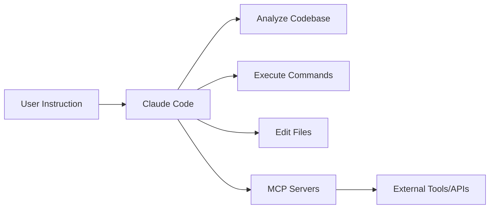

# What is Claude Code?

Claude Code is Anthropic's official command-line interface (CLI) tool, designed specifically for software developers to boost productivity through AI assistance.

## Core Features

### 1. Powerful Code Understanding

Claude Code can:
- Read and understand entire codebases
- Analyze code structure and dependencies
- Provide context-aware suggestions

### 2. Autonomous Task Execution

Unlike traditional AI chat tools, Claude Code can:
- Execute commands automatically
- Edit and create files
- Run tests and builds
- Commit code and create PRs

### 3. Extensibility

Extend functionality through the following mechanisms:
- **MCP Servers** - Connect external tools and services
- **Sub-Agents** - Create specialized AI assistants
- **Slash Commands** - Define custom commands
- **Hooks** - Respond to specific events

## How It Compares to Other Tools

| Feature | Claude Code | Gemini CLI | GitHub Copilot | ChatGPT |
|---------|-------------|------------|----------------|---------|
| Code completion | ✅ | ✅ | ✅ | ❌ |
| Autonomous task execution | ✅ | ✅ | ❌ | ❌ |
| File system operations | ✅ | ✅ | ❌ | ❌ |
| Extensibility | ✅✅ | ✅✅ | Limited | ❌ |
| Context understanding | ✅✅ | ✅✅✅ | Limited | Limited |

## Typical Use Cases

### Everyday Development

```bash
# Implement a new feature
$ claude "add user authentication"

# Fix a bug
$ claude "fix the styling issue on the login page"

# Refactor code
$ claude "refactor UserService to use dependency injection"
```

### Project Management

- Automated testing and builds
- Generating and updating documentation
- Code review and quality checks
- Creating PRs and managing Git

### Learning and Exploration

- Understanding complex codebases
- Learning new tech stacks
- Best practice recommendations

## How It Works



1. **Understand Requirements** - Analyze user instructions and project context
2. **Plan Execution** - Outline the steps to take
3. **Execute Tasks** - Autonomously complete development tasks
4. **Report Results** - Summarize what was done

## Getting Started

Ready to begin?

👉 [Installation and Configuration](/getting-started/installation)

## Related Resources

- [Official Documentation](https://docs.claude.com/claude-code)
- [GitHub Repository](https://github.com/anthropics/claude-code)
- [MCP Protocol](https://modelcontextprotocol.io/)
